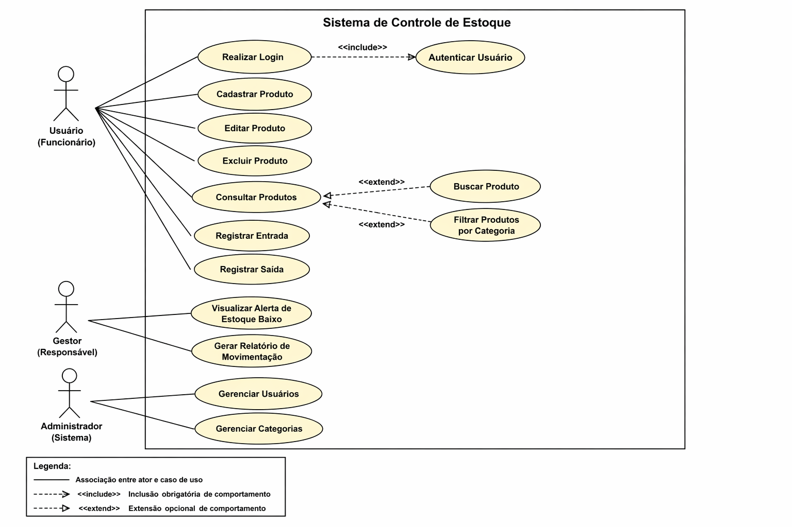
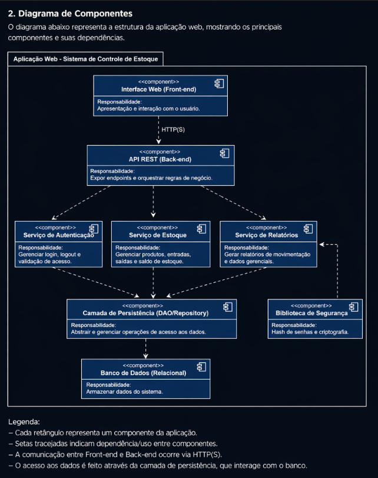

# Modelagem

### 1. Diagrama de Casos de Uso

O diagrama de casos de uso representa os principais atores do sistema e as funcionalidades disponíveis para cada perfil.

- Atores:
  - Usuário (Funcionário)
  - Gestor (Responsável)
  - Administrador

- Principais funcionalidades:
  - Autenticação no sistema
  - Cadastro e gerenciamento de produtos
  - Registro de entradas e saídas
  - Consulta, busca e filtro de produtos
  - Visualização de alertas de estoque
  - Geração de relatórios

---

### 2. Diagrama de Componentes

O diagrama de componentes representa a estrutura da aplicação web, evidenciando a separação entre front-end, back-end, serviços e persistência de dados.

- Principais componentes:
  - Interface Web (Front-end)
  - API REST (Back-end)
  - Serviço de Estoque
  - Serviço de Autenticação
  - Serviço de Relatórios
  - Camada de Persistência
  - Banco de Dados

## Observações

- Os diagramas foram desenvolvidos utilizando PlantUML.
- A modelagem segue os requisitos funcionais definidos no backlog do projeto.
- Foram aplicados os relacionamentos include e extend conforme a semântica UML.

---

##  Responsável

Diagramas desenvolvidos por: **Lucas Neves**

### 3. Diagrama de Sequência

O diagrama de sequência descreve a interação entre os componentes do sistema e a ordem cronológica das mensagens trocadas para realizar o registro de uma entrada de mercadoria.

- **Participantes:**
  - **Usuário (Estoquista):** Responsável por informar os dados da movimentação.
  - **Frontend Web:** Interface que captura os dados e exibe o feedback.
  - **API Backend:** Camada lógica que processa as regras de negócio e validações.
  - **Banco de Dados:** Camada de persistência que armazena os registros e atualiza os saldos.

- **Fluxo Principal (Registro de Entrada):**
  1. O usuário seleciona o produto e a quantidade no frontend;
  2. O frontend envia uma requisição POST para a API;
  3. A API valida a existência do produto no banco de dados;
  4. A API registra a nova movimentação na tabela de `movimentacoes`;
  5. A API atualiza o campo `qtd_atual` na tabela de `produtos`;
  6. O sistema retorna uma confirmação de sucesso (HTTP 201) para o usuário.

### 4. Modelo de Dados (DER)

O modelo relacional de dados apresenta a estrutura de persistência da aplicação, garantindo a integridade referencial e a organização das informações de produtos, estoque e movimentações.

- **Entidades principais:**
  - `Produto`: Armazena os dados cadastrais dos itens.
  - `Estoque`: Controla o saldo atual e os limites de segurança (estoque mínimo).
  - `Movimentacao`: Registro histórico de todas as entradas e saídas.
  - `Usuario`: Dados para autenticação e controle de acesso.

##  Responsável

Diagramas desenvolvidos por: **Mark Leite**

